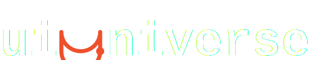

<div align="center">



<br /><br />

**Motion UI components built for the AI era.**

Ship stunning landing pages in minutes — not days.

<br />

[](#license)
[](#)
[](#)
[](#)

<br />

[Explore Components](https://uiuniverse.dev) · [Get Started](#get-started) · [AI Integration](#ai-native-by-design)

</div>

---

## What is uiUniverse?

A focused library of animated React components, backgrounds, and full page sections — powered by a coherent motion system and designed from the ground up for AI coding tools.

```tsx
import { FadeUp, StaggerGroup } from "@ui-universe/ui";

export function Hero() {
  return (
    <StaggerGroup stagger="normal">
      <FadeUp>
        <h1 className="text-6xl font-bold">Build faster.</h1>
      </FadeUp>
      <FadeUp>
        <p className="text-xl text-neutral-400">
          Motion components that just work.
        </p>
      </FadeUp>
    </StaggerGroup>
  );
}
```

Every component uses the same motion system. Same easings. Same timing. Your pages feel intentional — not stitched together.

---

## Why uiUniverse?

### AI-Native by Design

Every component ships with a **machine-readable descriptor** — not just docs for humans.

```json
{
  "name": "FadeUp",
  "props": { "preset": { "type": "MotionPresetName", "default": "fadeUp" } },
  "recommendedWith": ["StaggerGroup", "GradientBackground"],
  "aiPromptHint": "Use FadeUp to reveal content sections on scroll..."
}
```

AI agents (Claude, Cursor, Copilot) consume these descriptors to generate correct, composable code — no hallucinated props, no guessing.

### Coherent Motion System

Not a random collection of effects. A **system**.

| Token | Values |
|---|---|
| **Easing** | `smooth` · `snappy` · `dramatic` · `decel` · `spring` |
| **Duration** | `instant(100ms)` · `fast(200ms)` · `normal(400ms)` · `slow(600ms)` |
| **Stagger** | `tight(40ms)` · `normal(80ms)` · `relaxed(150ms)` |
| **Presets** | `fadeUp` · `fadeDown` · `scaleIn` · `popIn` · `blur` · `slideUp` + more |

All components pull from the same tokens. Change one value, the entire site updates.

```tsx
import { presets, easing, duration } from "@ui-universe/tokens";
```

### TypeScript + Tailwind. Nothing Else.

No CSS modules. No JavaScript variants. One source of truth:

- **TypeScript** — full type safety, autocomplete everywhere
- **Tailwind CSS v4** — utility-first, zero runtime overhead
- **Motion** — the Framer Motion successor, production-ready

---

## Get Started

### Install

```bash
pnpm add @ui-universe/ui @ui-universe/tokens motion
```

### Use

```tsx
import { FadeUp } from "@ui-universe/ui";

<FadeUp preset="fadeUp" delay={100}>
  <div>Your content here</div>
</FadeUp>
```

### Tree-shakeable imports

```tsx
// Import just what you need
import { FadeUp } from "@ui-universe/ui/animations";
```

---

## Architecture

```
uiUniverse/
├── packages/
│   ├── ui/             → @ui-universe/ui        Components + hooks + primitives
│   └── tokens/         → @ui-universe/tokens     Motion system + design tokens
├── apps/
│   └── web/            → uiuniverse.dev          Docs site + component explorer
└── scripts/            → Generators + tooling
```

**Monorepo** powered by pnpm workspaces + Turborepo. Every package builds independently, ships tree-shakeable ESM + CJS with full type declarations.

---

## Component Anatomy

Every component is three files. No exceptions.

```
fade-up/
├── fade-up.tsx              → The component
├── fade-up.descriptor.json  → AI-readable contract
└── fade-up.test.tsx         → Tests
```

The descriptor is the key innovation. It serves three audiences simultaneously:

| Audience | What they read |
|---|---|
| **AI agents** | `aiPromptHint`, `props`, `recommendedWith`, `examples` |
| **Docs site** | Auto-generates pages, prop tables, navigation |
| **Lab Mode** | Auto-generates visual configuration controls |

---

## Roadmap

- [x] Motion token system
- [x] Component library foundation
- [x] First animation primitives (FadeUp, StaggerGroup, MotionContainer)
- [x] JSON descriptor schema + AI integration
- [x] Next.js docs site with auto-generated pages
- [ ] Animation components (scroll reveals, transitions, entrance effects)
- [ ] Text animation components (typewriters, gradient text, split reveals)
- [ ] Background primitives (gradients, particles, beams, noise)
- [ ] Full page sections (heroes, pricing, features, CTAs)
- [ ] Lab Mode — visual component configurator
- [ ] CLI for component installation
- [ ] `llms.txt` endpoint for AI discovery

---

## Contributing

We welcome contributions. See the component anatomy above — every new component follows the same three-file pattern.

```bash
# Generate a new component scaffold
pnpm new:component

# Development
pnpm dev

# Run tests
pnpm test

# Lint
pnpm lint
```

---

## License

MIT + Commons Clause — free to use in any app, website, or product. Cannot be resold or redistributed as a standalone component library.

See [LICENSE](./LICENSE) for details.

---

<div align="center">
<br />

**Built with obsessive attention to motion, developer experience, and AI.**

<br />
</div>
